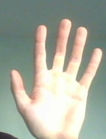
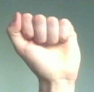

# tello_drawer

Draw a shape in space with your hand and make the drone replicate this shape!
The drone stays in the air and watches your hand by the camera.
The images from the camera are being sent to the PC, where your hand and its pose are detected.
The detected hand movement is then converted to drone steering commands which makes the drone replicate your movement.

## Steering
There are two methods to draw the drawing. The method can be chosen
by providing `finish_drawing` argument while running the script.:  
- First allows the user to draw by **any hand gesture**. The drawing is finished by showing **two hands at once**.
- The second allows the user to draw by the **palm gesture**. The drawing is finished by showing a **fist gesture**.
  Note, that if more than one hand is being shown, the drawing will be made by a right hand.




## Performance

## Prerequisites
- Python 3.8


## Cloning the repository
To clone the repository use the following lines
```
git clone https://github.com/arekmula/tello_drawer
cd tello_drawer
```

Create and activate virtual environment
```
python3 -m venv venv
source venv/bin/activate
```

Install requirements
```
pip install -r requirements.txt
```

Create `models` directory
```
cd src
mkdir models
```

Download detector model and its weights along classification model from the **Releases** page and add it to the `models`
directory.

## Using the repository
### Tello Drawer
To run the Tello Drawer use following commands:
- To run with the the Tello drone:
```
python3 main.py 
```
While running up the script you can set additional parameters:
```
--finish_drawing - Finish drawing sign
--max_area - The max area [cm] that drone can use to perform the drawing
--min_length - Minimum length between points, to reduce number of points from detection
--takeoff_offset - Takeoff move up offset in cm
```

- You can also run the test drawing with your built-in PC camera or video that you recorded earlier.
```
python3 main.py --image_source "built_camera" --camera_index 0
python3 main.py --image_source "saved_file" --filepath "path/to/file"
```


### Dataset saver
The dataset saver helps in gathering the data using the Tello drone for further processing.
It connects to the Tello drone, activates the video stream, and saves each received frame.
```
python3 dataset_saver.py --save_img True 
```
- Set fps with `--fps` flag
- Set dataset saving directory with `--save_dir`


### Hand detection
To detect hands on the image we utilized cansik's YOLO hand detector which is available
[here](https://github.com/cansik/yolo-hand-detection).
We haven't made any changes to the detector. 

### Hand classification
We have to split the hand detections into 2 separate classes.
The fist is responsible for the start/stop signal while the palm is responsible for drawing. To do so we created 
classifier based on pretrained EfficientNetB0. Date base is available [here](https://www.gti.ssr.upm.es/data/HandGesture_database.html)

TODO: Improve accuraccy of hand classification in real environment.